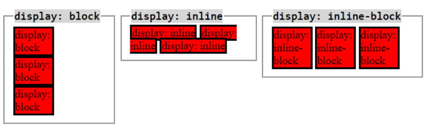

# CSS (Cascading Styling Sheet)
## Introduction
Purpose: used for webpage make-up
Application: There are 3 types in which we apply CSS styles:
1. inline: i.e., HTML tags with CSS attributes
    * <tag style="attribute1:value1; attribute2=value2; attribute3=value3; ...">
2. internal: HTML tags and CSS styles won't be in same line, rather in the same project
    * Syntax:
    <head>
        
    </head>
    * It helps to define common attribute for whole program. However, 'inline' setting takes up more memory (whose?)
    * 
        </head>
    - E.g: 
        <head>
            
        </head>
    - Syntax for External way for a Class selector:
    ...

3. id-selector
    - Used to apply unique styles for a specific element in specific place in the program
    - in order to apply style to multiple elements we don't give them same id, rather give them same class
    - Syntax: 
        #id-name
        {
            property1:value1;
            property2:value2;
            ...
        }
        For: <tag id = "id-name">
    Note: it is expected to not use the same id for multiple tags/instances
    - E.g.: 
        #id1
        {
            color:red;
        }
        <h1 id='id1'>HTML Course</h1>

4. hover-selector
    - it changes the look when pointer is brought above the element
    - a type of pseudo selector
    - Syntax: 
        tag/tag-id/tag-class:hover
        {
            property1:value1;
            property2:value2;
            ...
        }

5. universal-selector
    - to apply properties to all the elements of the page
    - Syntax:
    *{
        property1:value1;
        property2:value2;
        ...
    }

6. first-child/last-child/n-child
    - a type of pseudo-selector, used to apply attributes to first child tag only
    - applied to parent tags
    - Syntax:
        tag/tag-id/tag-class:first-child
        {
            property1:value1;
            property2:value2;
            ...
        }
    - There are similar other like: last-child, n-child
    - Syntax last-child: 
        tag/tag-id/tag-class:last-child
        {
            property1:value1;
            property2:value2;
            ...
        }
    - Syntax n-child: 
        tag/tag-id/tag-class:n-child
        {
            property1:value1;
            property2:value2;
            ...
        }

7. child-selector
    - to apply attributes to only the parent and the child
    - the no. of childs we can define can be any generation
    - Syntax: 
        p-tag c1-tag c2-tag ... {
            property1:value1;
            property2:value2;
            ...
        }
    - here, c1-tag is for children, c2-tag is for grand-children, and so on (we are not talking abt the number of the child)
    - here, p-tag is for parent tag

8. direct-child
    - to apply attributes to only the parent and the generation-1 children
    - the no. of children of first generation are applicable and NOT further (like grand-children, etc)
    - Syntax: 
        p-tag > c-tag{
            property1:value1;
            property2:value2;
            ...
        }
    - here, '>' defines the direct-child selector
    - here, p-tag is for parent tag

9. attribute-selector
    - to apply attributes to the attribute, and hence applicable to all tags/id/etc. wherever attribute is used.
    - Syntax: 
        [attribute]{
            property1:value1;
            property2:value2;
            ...
        }
    - mentioning tag is not required

10. pseudo-selector
    - Syntax: 
    tag/child/id/class/attribute/direct-child/group:name-of-the-property
    {
        property1:value1;
        property2:value2;
        ...
    }
    - For pseudo selector, use ':', like x.html
    - For pseudo element, use '::', like
        - ::before{...}
        - ::after{...}
        - ::first-letter{...}
        - ::first-line{...}
        - ::selection{...}
        - ::placeholder{...}
        - ::marker{...}

11. compound-selector
    - compound of parents-childs
    - E.g.:
        p a, div a, table a{
            property1:value1;
            property2:value2;
            ...
        }
    - Explanation: properties are applicable to <a> tag of 
, 
 and <table> tags

12. group-selector
    - properties defined for a group of selectors
    - the tags need not be of parent-child type
    - selectors can be different type as well
    - E.g.: 
        h1, #id1, .class1, p a:hover{
            property1:value1;
            property2:value2;
            ...
        }

Note: there is a precedence order in which selectors are applied if an elements qualifies for multiple selectors: 
id-selector > attribute-selector > class-selector > child-selector > direct-child-selector > tag-selector > browser settings

## CSS Attributes
#### Text attributes
1. text-shadow
    * to display shadow on text
    * Syntax:
        text-shadow: Xpx Ypx color;
            where XY are: ++ -+ -- +- (1, 2, 3, 4 quadrants)
        text-shadow: px1 px2 px3 px4 color;
            quad in clockwise dimension of shadow
2. font-size: used to change size of text
    * Syntax: font-size: Npx;
3. font-family: used to change text writing style
    * Syntax: font-family:<name>;
    * name - tahoma, arial, times new roman, etc.
    Notes: 
    1. We can give multiple font family names separated by space. The browser will choose from left to right whatever is available.
    2. And in case none of the provided is available, then default font of the browser precedes.
    3. And if all/multiple supported then leftmost will be selected.
    4. this helps to fix different browser problem
    5. Reference: H:\vs-code\css-practice\resources\font-family.JPG
4. text-decoration: to define underlining of hyperlink
    E.g.: 
    - text-decoration:none; // to remove underlying of hyperlink
    - text-decoration:underline/overline/line-through; <!-- just position for the line -->
    - text-decoration:underline dotted red; <!-- position type color -->
    - text-decoration:green wavy underline; <!-- color type position -->
    - text-decoration:underline overline red; <!-- position position color -->
    - Reference: https://developer.mozilla.org/en-US/docs/Web/CSS/text-decoration#:~:text=CSS%20Demo%3A%20text%2Ddecoration
    Note: 
    1. text-decoration-style: <type>;
        - 'type' - solid, double, dotted, dashed, wavy
        - this attribute helps to define decoration-style instead of giving in the same line as above examples
5. font-weight: 
    - values: normal/bold/bolder/lighter, or 
    - values: 100-900
6. line-height: to set distance between line in a paragraph
    - Ways to define: 
        1. px
        2. type: normal (by default)
    - E.g.: 
        - line-height: normal;
        - line-height: 20px;
7. text-transform: to set case of the text, i.e., uppercase/lowercase/capitalize/none
    - uppercase: to set all content as capital letters (vice-versa for lowercase)
    - capitalize: to set first letter of each word as capital
    - none: used only if properties are set before and now we want to nullify it

#### 'List' attributes
1. list-style-type:
    * used to specify the list bullet (same for <ol> and <ul>)
    * Syntax: 
    list-style-type:<type>
    <type>: 
        decimal
        upper-alpha
        lower-alpha
        upper-roman
        lower-roman
        lower-greek
        leading-zero-decimal
        none
        dot
        circle
        square
2. list-style-image:
    * used to specify images for list bullets (all same or all different)
    * Syntax:
        list-style-image:url/filename
        url: source location from anywhere
    * bullet icons need to be small, else the margin gets hampered. 

#### Other Attributes
1. colors:
    * defined in 3 ways:
        1. color name (e.g., red, green, blue, cyan, etc.)
        2. rgb (range 0-255 for each) - e.g., rgb(100,255,150)
        Note: if rgb value for any component is given >255, like 355 => 355%255 = 100 (modulus operation)
        3. hexadecimal colors (range 0-F for all 6 bits of 8 bits each) - #18bb6e
    * Property: 
        color:rgb(x,y,z)
        - this is are for global attributes
        - this property is for foreground color (what appears first)
        background-color:rgb(x,y,z)
        - this is for inline
        - this property is for background color (what appears at the back, for text it appears as text highlighter)
    * E.g.: <h1 style="color:red; background-color=yellow;">...text...</h1>
2. display:
    * used to change the position of HTML element.
    * Syntax: 
        display:inline; // to define tags inline
        display:block; // to make inline tags to go in block (separate lines) or like to display block kind of figure around anything/text
        display:inline-block; // to display inline and block level components side-by-side with uniform margin
        display:none; // to hide element on webpage till user wants it to come to sight
        display:grid; //to display elements grid-wise
        display:flex; // to display elements in column/row (or matrix) -wise (also called containers)
    * 
    Note: 
    a. heading tags (h1, h2, etc.) are not inline by default. Hence, when we define "display" attribute as inline to make them inline.
    b. anchor tag is inline by default
    c. in case of defining display attribute for same tag multiple times, then only first one is considered with its value.
    * E.g.: 
    1. display:inline;
        <h1 style="background-color:red;display:inline;">CSS</h1>
        <h1 style="background-color:red;display:inline;">HTML</h1>

        Output: 
        CSS     HTML
    2. display:flex;
        
        <body>
            

                

                    <h1>Jan</h1>
                

                

                    <h1>Feb</h1>
                

                

                    <h1>Mar</h1>
                

                

                    <h1>Apr</h1>
                

            

        </body>
        Note: 
        1. The width of the content increases as per the no. of letter.
        2. 'Flex' type of 'display' attribute, is defined for outer tag but applied to inner tags.
        3. if no. of contents are added further, then the columns will keep on increasing in same line with width addusting by itself.
        4. Other attributes related to "display:flex" attribute: 
            - flex-direction: row (default)/column/row-reverse/column-reverse
            - flex-wrap: wrap/nowrap
            - gap:10px (to apply gap of 10pm between each containers)
        5. 'display:flex' attribute is good for column-matrix or row-matrix view of data
    3. display:inline-block;
    

    <a href=".." class="menus">Course</a>
    <a href=".." class="menus">Services</a>
    <a href=".." class="menus">Batches</a>
    <a href=".." class="menus">Contact</a>

    Output:
    -----------------------------------------
    | Course | Services | Batches | Contact |
    -----------------------------------------
    4. display:grid;
    Syntax: grid-template-columns:col1-px col2-px col3-px ... coln-px;
    <style>
        .main-div
        {
            display:grid;
            grid-template-columns:auto auto auto ... auto;
            // grid-template-columns: 300px 500px ... 400px;
            // grid-template-columns: 30% 40% 30%;
            column-gap: 20px;
            row-gap: 20px;
            grid-gap: 20px 30px; //row-gap col-gap
        }

3. float: used to change the position of division columns (i.e., 
 tag elements)
    * Syntax: 
        

        ...
        

        Output: 
        float:left    => column1 column2
        float:right   => column2 column1
    * Note: This attribute does not just shift the columns but also flips them.
4. Animation 
    A. Two-point animation
        - Syntax:
            @keyframes ani-name{
                from{property1:old-value1;property2:old-value2;...}
                to{property1:new-value1;property2:new-value2;...}
            }
    B. Multi-point animation
        - Syntax:
            @keyframes ani-name{
                w% {property1:old-value1;property2:old-value2;...}
                x% {property1:new-value1;property2:new-value2;...}
                ...
                z% {property1:new-value1;property2:new-value2;...}
            }
        - total % should be 100
    - Applying animation to a selector:
        - Syntax: 
            selector{
                animation-name:ani-name;
                animation-duration:timer (with units like s/ms/min);
                animation-iteration:5/infinite;
                animation-directio:normal/reverse/alternate
                }